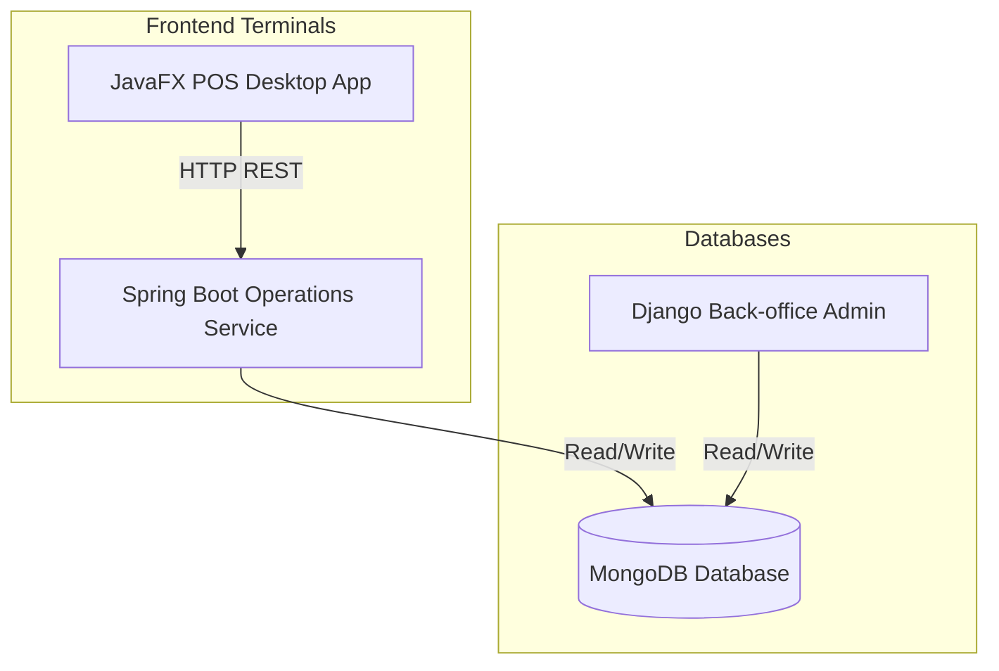

# RMS — Restaurant Management System (POS & Admin)

A comprehensive, enterprise-ready Restaurant Management System (RMS) designed with a hybrid microservices architecture. It combines a dynamic back-office manager web portal, an operational REST backend, and a high-performance native desktop terminal for cashiers.

## 🏛️ Architecture Overview

The system consists of three distinct service layers communicating through a shared MongoDB instance:



1.  **Back-office Admin Portal (Python/Django):** Provides inventory tracking, table status, reservation booking, menu management, and sales metric dashboards. Powered by Django 3.0 and the **Django Jazzmin** dashboard framework.
2.  **Operations Engine (Java/Spring Boot):** Acts as the high-availability REST API server for order intake, table querying, and transactional writes.
3.  **POS Terminal (JavaFX):** A native, responsive desktop application for order takers and cashiers. Supports real-time category filtering, table selection, live connection alerts, quantity modifiers, and automated receipt printing.

---

## 🛠️ Stack & Technologies

*   **Admin service:** Django 3.0, Djongo, Django Jazzmin (AdminLTE 3)
*   **Operations service:** Spring Boot 3.1.2, Spring Data MongoDB
*   **POS terminal:** Java 17, JavaFX 21, Jackson Databind, Maven
*   **Database:** MongoDB

---

## 🚀 Running the Application

Ensure you have **MongoDB** running locally on port `27017` before starting the services.

### 1. Back-office Django Admin
1. Navigate to the project root:
   ```bash
   cd /Users/hari/RMS
   ```
2. Activate the python virtual environment:
   ```bash
   source venv/bin/activate
   ```
3. Run the development server:
   ```bash
   python manage.py runserver
   ```
4. Access the portal at [http://127.0.0.1:8000/admin/](http://127.0.0.1:8000/admin/)
   * **Username:** `admin`
   * **Password:** `admin`

### 2. Operations Service (Spring Boot API)
1. Navigate to the operations service directory:
   ```bash
   cd /Users/hari/RMS/operations_service
   ```
2. Add the bundled Maven environment to your path and start the application:
   ```bash
   export PATH=$PWD/apache-maven-3.9.9/bin:$PATH
   mvn spring-boot:run
   ```
   The backend API will start serving requests on [http://localhost:8080/](http://localhost:8080/).

### 3. POS Native Desktop Terminal (JavaFX)
1. Navigate to the desktop application directory:
   ```bash
   cd /Users/hari/RMS/pos_desktop_app
   ```
2. Run the application:
   ```bash
   export PATH=/Users/hari/RMS/operations_service/apache-maven-3.9.9/bin:$PATH
   mvn javafx:run
   ```

---

## 🧾 POS Receipt Printer
Whenever checkout is performed on the cashier terminal, a beautifully formatted text receipt is automatically printed to:
`/Users/hari/RMS/receipts/receipt_order_<id>.txt`

---

## 📈 Database Schema & Seeding
The database contains collection mappings for:
*   `core_menuitem` — Menu items (Name, Price, Category, Availability)
*   `core_table` — Dining tables (Table number, Capacity, Occupancy status)
*   `core_inventoryitem` — Raw stock levels with reorder thresholds
*   `core_order` — Transacted sales receipts containing JSON item arrays
